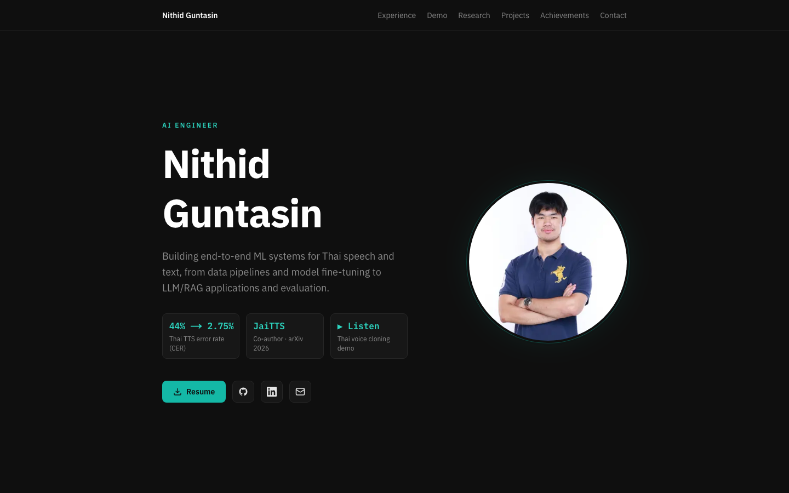

# Nithid Guntasin — Portfolio

Personal portfolio site for an AI Engineer working on Thai speech and text. Built with Next.js and Tailwind CSS.

**Live site:** [portfolio-topaz-kappa-94.vercel.app](https://portfolio-topaz-kappa-94.vercel.app/)



## Highlights

- **All content in one file.** Every role, project, metric and link lives in `data/profile.ts`, so a CV update is usually a one-file edit.
- **Playable Thai voice-cloning demo** with the reference voice and generated samples side by side.
- **Built for phones and keyboards:** swipeable gallery and nav, current-section highlight, lightbox focus handling, `prefers-reduced-motion` support, and Thai text marked with `lang="th"`.
- **Static and fast:** the whole site is prerendered, with fonts self-hosted through `next/font`.

## Tech stack

- [Next.js](https://nextjs.org/) 16 (App Router)
- [React](https://react.dev/) 19
- [TypeScript](https://www.typescriptlang.org/)
- [Tailwind CSS](https://tailwindcss.com/) 4
- [IBM Plex](https://www.ibm.com/plex/) Sans, Sans Thai and Mono via `next/font`

## Getting started

Requires Node.js 20.9 or later.

```bash
npm install
npm run dev
```

Open [http://localhost:3000](http://localhost:3000).

## Build

```bash
npm run build
npm start
```

## Project structure

```
app/              # Next.js app router: layout, page, favicon (icon.tsx), social preview image
components/       # One component per page section (Hero, Experience, Projects, ...)
  ui.tsx          # Shared building blocks: Section, Card, BulletList, StatTiles, ...
  icons.tsx       # Shared SVG icons
data/profile.ts   # All site content (text, links, metrics)
docs/             # README screenshot
public/           # Static assets
  audio/          # Voice cloning demo samples
  super-ai/       # Super AI Engineer winning-team photos
```

## Updating content

| What to change | Where |
|---|---|
| Name, title, tagline, about, contact links | `profile` in `data/profile.ts` |
| Hero proof chips | `profile.highlights` |
| Work experience and before/after result tiles | `jobs` (`keyResults` for the tiles) |
| Voice demo samples | `voiceDemo` + files in `public/audio/` |
| Projects, incl. pipeline diagram and result tiles | `projects` (`pipeline`, `results`) |
| Super AI stat tiles and photos | `superAI` (`highlights`, `photos`) + files in `public/super-ai/` |
| Research, other hackathons, skills, education | matching export in `data/profile.ts` |
| Accent colour | `--color-accent-300/400/500` in `app/globals.css` |
| Fonts | `app/layout.tsx` |
| Resume file | replace `public/Resume_NithidGuntasin.pdf` |
| Profile photo | replace `public/photo.jpg` (also used in the social preview image) |
| Page title / SEO description | built from `profile` in `app/layout.tsx` |

## Deploy

Hosted on [Vercel](https://vercel.com/). Every push to `main` deploys to the live site automatically.
